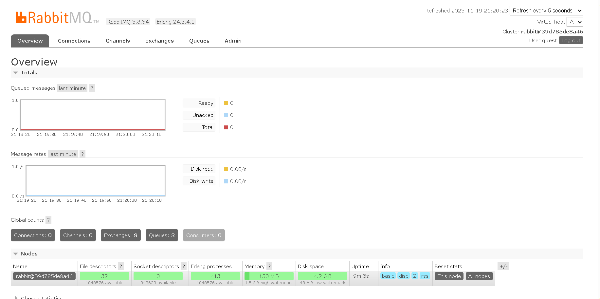

# Homework 7

👉 Students make a simple demonstration for showing how to use gRPC to integrate 2 systems
👉 Students make a simple demonstration for showing how to use Messag Queue to integrate 2 systems, follow the request/reply, pub/sub, remote procedure call
👉 Students describe the differences between synchronous api call and asynchronous api call
👉 Students make a simple demonstration for creating simple chat application using socket.io / SignraR or other libraries

Let's dive in

# Using gRPC to integerate 2 systems by NodeJS

## Prerequisite:

1.  NodeJS

## 1. Setup folder

```console
$ mkdir gRPC
$ cd gRPC
$ npm init
```

## 2. Install libraries/dependencies

Let's install 2 libraries/dependencies:

1. @grpc/grpc-js: Allows you to create gRPC servers and clients in JavaScript. It provides the necessary tools to interact with gRPC services, make RPC calls, and handle communication between client and server.
2. @grpc/proto-loader: This package is used to load Protocol Buffers (.proto files) in Node.js applications. A module that helps in loading, parsing, and converting Protocol Buffer definitions to usable JavaScript objects

```console
$ npm install @grpc/grpc-js @grpc/proto-loader
```

Our package.json file will look alike below:

```json
{
	"name": "grpc-node",
	"version": "1.0.0",
	"description": "integrate 2 systems",
	"main": "",
	"scripts": {
		"test": "echo \"Error: no test specified\" && exit 1"
	},
	"author": "",
	"license": "ISC",
	"dependencies": {
		"@grpc/grpc-js": "^1.9.11",
		"@grpc/proto-loader": "^0.7.10"
	}
}
```

## 3. Defining the services

Next, we define the gRPC _service_ and the method _request_ and _response_ types using protocol buffers (all in .proto file).
We create a .protofile named `person.proto` in new folder `protos`.

```console
$ mkdir protos
$ cd protos
$ echo > person.proto
```

To define a service, we specify a named service in our `.proto` file.

```console
service Person {
   ...
}
```

Then we define rpc methods inside our service definition, specifying their request and response types. gRPC lets us define our kinds of service methods, all of which are used in the `Person` service:

```console
service Person {
   // Get a person by id
    rpc GetPerson(PersonRequest) returns (PersonResponse) {}
}
```

Now, we define our request/response structure `PersonRequest` and `PersonResponse`with keyword `message`

```console
message PersonRequest {
  int32 id = 1;
}

message PersonResponse {
  int32 id = 1;
  string name = 2;
}
```

The whole file `person.proto` will look like this

```console
syntax = "proto3";

service Person {
   // Get a person by id
    rpc GetPerson(PersonRequest) returns (PersonResponse) {}
}

message PersonRequest {
  int32 id = 1;
}

message PersonResponse {
  int32 id = 1;
  string name = 2;
}
```

The `syntax = "proto3"`; statement is essential because it informs the Protocol Buffers compiler about the specific syntax version to be used for parsing and interpreting the content of the `.proto` file.

## 4. Loading service descriptors from proto files

The Node.js library dynamically generates service descriptors and client stub definitions from `.proto` files loaded at runtime.

To load a `.proto` file, simply require the gRPC proto loader library and use its `loadSync()` method, then pass the output to the gRPC library’s `loadPackageDefinition` method:

```console
var PROTO_PATH = __dirname + '/protos/person.proto';
var grpc = require('@grpc/grpc-js');
var protoLoader = require('@grpc/proto-loader');
// Suggested options for similarity to existing grpc.load behavior
var packageDefinition = protoLoader.loadSync(PROTO_PATH, {
	keepCase: true,
	longs: String,
	enums: String,
	defaults: true,
	oneofs: true,
});

var personProto = grpc.loadPackageDefinition(packageDefinition);
```

Once we done this, the stub constructor is in the personProto namespace and the service descriptor (which is used to create a server) is a property of the stub;

## 5. Create the server

First, our server has a `Server` constructor generated from service descriptor.

```console
var server = new grpc.Server();
```

Second, we implement the service method, which is `getPerson`. Before that, we can prepare a list of person data (object with `id` and `name`)

```console
const data = [
	{ id: 0, name: 'admin' },
	{ id: 1, name: 'user' },
];
function getPerson(call, callback) {
	const requestedId = call.request.id;
	const personData = data.find((item) => item.id == requestedId);
	callback(null, personData);
}
```

This function get the id of request sent to and search the person in `data` whose id equals to it. `callback` function will run to send the response containing the data back to gRPC client.
`callback` has 2 arguments:

1. `null` represent an error.
2. `personData` contains the data (if found) or undefined (if not found).

Third, we define the service to the gRPC server.

```console
server.addService(personProto.Person.service, { getPerson: getPerson });
```

- `personProto.Person.service`: This references the service definition from the `personProto` object, which is generated from the `.proto` file using gRPC tools. It represents the service definition (`Person`) defined in the `.proto` file.
- `{ getPerson: getPerson }`: Within the `Person` service, this associates the `getPerson` method defined in the service with the `getPerson` function in your Node.js code. It links the RPC method in the gRPC service definition (`getPerson`) to the JavaScript function (`getPerson`) that will handle this specific RPC call when invoked.

Next part,

```console
server.bindAsync(
	'0.0.0.0:50051',
	grpc.ServerCredentials.createInsecure(),
	() => {
		server.start();
	}
);

```

This code snippet will set the server to listen on a specific port (`50051`).

- The IP address 0.0.0.0 used in the server.bindAsync() function call indicates that the gRPC server should listen on all available network interfaces on the machine. It means the server will be reachable via any of the IP addresses associated with the machine, including 127.0.0.1 (localhost), the local loopback address.

- `grpc.ServerCredentials.createInsecure()`: Creates server credentials using the `createInsecure()` method, indicating that the server will run without any transport security (no encryption). This is suitable for development or testing environments but not recommended for production.
- `() => { server.start(); }`: This is the callback function will run after the server is successfully bound to the specified address and port. Inside the callback, server.start() is called to start the gRPC server, making it ready to accept incoming gRPC requests.

The whole file will look like [this](https://github.com/nguyenphucbao68/wnc/blob/master/hw/w7/gRPC/server.js):

## Create the client

To call service methods, we first need to create a _stub_. To do this, we just need to call the `personProto` stub constructor, specifying the server address and port.

```console
	var client = new personProto.Person(
		'localhost:50051',
		grpc.credentials.createInsecure()
	);
```

`grpc.credentials.createInsecure()`: Creates insecure credentials for the gRPC client. In this context, `createInsecure()` method is used to set up the client without any transport security (no encryption).

And next, we simply call the method

```console
// Calling the RPC method
	client.getPerson({ id: 0 }, function (err, response) {
		if (err) {
			console.log('Fail to send request');
		} else {
			console.log('Hello: ', response);
		}
	});
```

## 6 Run server and client

Run the 2 following commands in 2 different cmd to see the result:

```console
$ node server.js
```

```console
$ node client.js
```

# Using RabbitMQ to integrate 2 systems (request/reply, pub/sub, remote procedure call)

## Prerequisite:

1. NodeJS
2. RabbitMQ (See [here](https://www.rabbitmq.com/download.html) to download)
   In my case, i use `docker-compose.yml` file to define the RabbitMQ service:

```console
version: '3.8'
services:
  rabbitmq:
    image: rabbitmq:3.8-management-alpine
    container_name: 'rabbitmq'
    ports:
      - 5672:5672
      - 15672:15672
    volumes:
      - ~/.docker-conf/rabbitmq/data/:/var/lib/rabbitmq/
      - ~/.docker-conf/rabbitmq/log/:/var/log/rabbitmq

```

- Port `5672:5672`: Exposes the RabbitMQ default port for AMQP communication.
- Port `15672:15672`: Exposes the RabbitMQ management UI web interface port.
  
  If you want to log in this rabbitmq web interface, you might need to log in. And the default account is: `user`: `guest`, `password`:`guest`

- Mounts specific directories from the host machine into the RabbitMQ container:

  - ~/.docker-conf/rabbitmq/data/:/var/lib/rabbitmq/: Mounts the host's RabbitMQ data directory to the container's /var/lib/rabbitmq/ directory. This allows persisting RabbitMQ data across container restarts.
  - ~/.docker-conf/rabbitmq/log/:/var/log/rabbitmq: Mounts the host's RabbitMQ log directory to the container's /var/log/rabbitmq directory for storing log data.

  To run docker compose the `docker-compose.yml` file. Do the following:

  ```console
  $ docker compose up
  ```

# I. Request - Reply pattern

## 1. Create folder

```console
$ mkdir request-reply
$ cd request-reply
$ npm init
```

## 2. Install the amqp.node client library

First, install amqp.node using npm:

```console
$ npm install amqplib
```

The package json will look like this:

```json
  "dependencies": {
    "amqplib": "^0.10.3"
  }
```

## 3. Implement server

We need to require the library first:

```console
var amqp = require('amqplib/callback_api');
```

then connect to RabbitMQ server

```console
amqp.connect('amqp://localhost', function(error0, connection) {});
```

Next we create a channel, which is where most of the API for getting things done resides:

```console
const channel = await connection.createChannel();
```

Next, we declare the request queue and reply queue on the RabbitMQ server:

```console
	const requestQueue = 'request_queue';

	await channel.assertQueue(requestQueue);
```

- `amqp.Channel.assertQueue(queue)` method to declare the queue on RabbitMQ server. If the queue does not exist, it will create a new one . In case the queue alread existed, it it will verify the queue's properties.

Next, we implement the server to wait on the request queue. If a message is caught, the the server will assert reply message to the reply queue.

```console
	channel.consume(requestQueue, (msg) => {
		console.log(`Received request: ${msg.content.toString()}`);

		const response = 'This is the server response!';

		channel.sendToQueue(msg.properties.replyTo, Buffer.from(response));
		channel.ack(msg);
	});
```

- `channel.consume()` sets up a consumer on the specified `requestQueue` to receive messages from this queue. When a message arrives, the provided callback function is invoked.
- `console.log(`Received request: ${msg.content.toString()}`);`: print the message content to console log.
- `const response = 'This is the server response!';`: declare a reply string to send to reply queue.
- `channel.sendToQueue(msg.properties.replyTo, Buffer.from(response));`: Send the `response` to the message reply queue defined in `msg.properties.replyTo`. RabbitMQ expect message payload to be binary data so we use `Buffer.from(response)`
- `channgel.ack(msg)`: Confirm to RabbitMQ that code has successfully processed the message and it can safely remove it from the queue, preventing it from being re-delivered in case of a consumer failure or disconnection.

The whole `server.js` will be [here](https://github.com/nguyenphucbao68/wnc/blob/master/hw/w7/rabbitMQ/request-reply/server.js)

## 4. Implement client

The setting up code in client is the same as server.

```console
const connection = await amqp.connect('amqp://localhost');
	const channel = await connection.createChannel();

	const requestQueue = 'request_queue';
	const replyQueue = 'reply_queue';

	await channel.assertQueue(requestQueue);
	await channel.assertQueue(replyQueue);

```

Now, we declare a request message:

```console
const message = 'Hello, Server!';
```

And then send to request queue:

```console
	channel.sendToQueue(requestQueue, Buffer.from(message), {
		replyTo: replyQueue,
	});
```

- We provide the `replyTo` property to note the reply queue client will consume once server send the response back.

Finally, client will consume response sent back from server:

```console
	channel.consume(
		replyQueue,
		(msg) => {
			console.log(`Received response: ${msg.content.toString()}`);
			connection.close();
		},
		{ noAck: true }
	);
```

- The callback function will print out the response message to console, then close connection.
- `{noAck: true}` options means that message consumed from the queue will be automatically acknowledged by RabbitMQ without requiring manual acknowledgment from the consumer.

The whole `client.js` will be [here](https://github.com/nguyenphucbao68/wnc/blob/master/hw/w7/rabbitMQ/request-reply/client.js)

# II. Pub-Sub pattern

In pub-sub pattern, a publisher will deliver message to multiple consumers.

To illustrate the pattern, we're going to build a simple logging system. It will consist of two programs -- the first will emit log messages and the second will receive and print them.

Essentially, published log messages are going to be broadcast to all the receivers.

## 1. Create folder

```console
$ mkdir pub-sub
$ cd pub-sub
$ npm init
```

## 2. Install the amqp.node client library

First, install amqp.node using npm:

```console
$ npm install amqplib
```

The package json will look like this:

```json
  "dependencies": {
    "amqplib": "^0.10.3"
  }
```

## 3. Implement publisher

We need to require the library first:

```console
var amqp = require('amqplib/callback_api');
```

then connect to RabbitMQ server

```console
amqp.connect('amqp://localhost', function(error0, connection) {});
```

Next we create a channel, which is where most of the API for getting things done resides:

```console
const channel = await connection.createChannel();
```

The core idea in the messaging model in RabbitMQ is that the producer never sends any messages directly to a queue. Actually, quite often the producer doesn't even know if a message will be delivered to any queue at all.

Instead, the producer can only send messages to an exchange. An exchange is a very simple thing. On one side it receives messages from producers and the other side it pushes them to queues. The exchange must know exactly what to do with a message it receives. Should it be appended to a particular queue? Should it be appended to many queues? Or should it get discarded. The rules for that are defined by the exchange type.

There are a few exchange types available: ``direct`, `topic`, `headers` and `fanout`. We'll focus on the last one -- the `fanout`. Let's create an exchange of this type, and call it `logs`:

```console
	const exchange = 'logs';
	const message1 = 'Log message 1';
	const message2 = 'Log message 2';

	await channel.assertExchange(exchange, 'fanout');
```

Now, we can publish the message to the exchange.

```console
  channel.publish(exchange, '', Buffer.from(message1));
	console.log(`Published: ${message1}`);

	channel.publish(exchange, '', Buffer.from(message2));
	console.log(`Published: ${message2}`);
```

And, we can set the time for the publisher to close.

```console
	setTimeout(() => {
		connection.close();
		process.exit(0);
	}, 500);
```

The whole `publisher.js` file is [here](https://github.com/nguyenphucbao68/wnc/blob/master/hw/w7/rabbitMQ/pub-sub/publisher.js):

## 3. Implement the subscriber

First we setup the same as publisher:

```console
  const connection = await amqp.connect('amqp://localhost');
	const channel = await connection.createChannel();

	const exchange = 'logs';

	await channel.assertExchange(exchange, 'fanout');
```

Next, we declare the queue to consume when the exchage emit the message:

```console
const { queue } = await channel.assertQueue('', { exclusive: true });
```

- We create a temporary queue with a random name and once the consumer is disconnected, the queue is automatically deleted (`{exclusive: true}`).

We've already created a fanout exchange and a queue. Now we need to tell the exchange to send messages to our queue. That relationship between exchange and a queue is called a binding.

```console
	channel.bindQueue(queue, exchange, '');
```

Lastly, we consume on the queue we created and print out the log message once it is sent to the queue.

```console
	channel.consume(
		queue,
		(msg) => {
			console.log(`Received log: ${msg.content.toString()}`);
		},
		{ noAck: true }
	);
```

The whole `subscriber.js` will be [here](https://github.com/nguyenphucbao68/wnc/blob/master/hw/w7/rabbitMQ/pub-sub/subscriber.js)

## 4. Run the publisher and subscriber

Run the publisher first:

```console
$ node publisher.js
```

Run the subscriber in multiple process to see all the receiver will receive the log:

```console
$ node subscriber.js
```

# III. RPC pattern

## 1. Create folder

```console
$ mkdir rpc
$ cd rpc
$ npm init
```

## 2. Install the amqp.node client library

First, install amqp.node using npm:

```console
$ npm install amqplib
```

The package json will look like this:

```json
  "dependencies": {
    "amqplib": "^0.10.3"
  }
```

## 3. Implement client

We need to require the library first:

```console
var amqp = require('amqplib/callback_api');
```

then connect to RabbitMQ server

```console
amqp.connect('amqp://localhost');
```

Next we create a channel, which is where most of the API for getting things done resides:

```console
const channel = await connection.createChannel();
```

Next, we declare the queue on the RabbitMQ server. Also, we need to create a exclusive replyQueue with a random name :

```console
	const queue = 'rpc_queue';
	const replyQueue = await channel.assertQueue('', { exclusive: true });
```

To make the request private and secure, we need a colleration id:

```console
const correlationId = generateUuid();
```

which is generated by a simple random function, this is for demo only. In fact, we should use other libraries to make the `correlationId` more secure.

```console
function generateUuid() {
	return (
		Math.random().toString() +
		Math.random().toString() +
		Math.random().toString()
	);
}
```

Next, we send the message to public queue on server. However, server will only know the reply queue for private client through `correlationId` and `replyTo` properties sent along with message.

```console
	const message = 'RPC request';
	channel.sendToQueue(queue, Buffer.from(message), {
		correlationId: correlationId,
		replyTo: replyQueue.queue,
	});
```

Finally, we setup a consumer to receive the message from server:

```console
	channel.consume(
		replyQueue.queue,
		(msg) => {
			if (msg.properties.correlationId == correlationId) {
				console.log(`Received response: ${msg.content.toString()}`);
				channel.close();
				connection.close();
			}
		},
		{ noAck: true }
	);
```

The whole file for `client.js` is [here](https://github.com/nguyenphucbao68/wnc/blob/master/hw/w7/rabbitMQ/rpc/client.js)

## 4. Implement server

The setup for server is discussed above. What is noticeable is the method to consume and send back to client below:

```console
const queue = 'rpc_queue';

	await channel.assertQueue(queue);

	channel.consume(queue, (msg) => {
		console.log(`Received RPC request: ${msg.content.toString()}`);

		const response = 'RPC response';
		channel.sendToQueue(msg.properties.replyTo, Buffer.from(response), {
			correlationId: msg.properties.correlationId,
		});

		channel.ack(msg);
	});
```

Th whole file `server.js` is [here](https://github.com/nguyenphucbao68/wnc/blob/master/hw/w7/rabbitMQ/rpc/server.js)

## 5. Run the server and client.

Run the server:

```console
$ node server.js
```

Run the client:

```console
$ node client.js
```

# Differentiation between synchronous api call vs asynchoronous api call

|             | Synchronous API                                                                                                                                                                            | Asychronous API                                                                                                                                                                                                                 |
| ----------- | ------------------------------------------------------------------------------------------------------------------------------------------------------------------------------------------ | ------------------------------------------------------------------------------------------------------------------------------------------------------------------------------------------------------------------------------- |
| Definition  | In synchronous API calls, the program waits for the response from the API before executing the next line of code.                                                                          | In asynchronous API calls, the program initiates the API request and continues executing other tasks without waiting for the response. When the response is available, a callback, promise, or event is triggered to handle it. |
| Pros        | **Simplicity**: Synchronous calls follow a linear flow, making code easier to understand and debug.                                                                                        | **Non-Blocking**: Enables the application to continue processing other tasks while waiting for responses. This prevents blocking and maximizes resource utilization.                                                            |
|             | **Predictability**: The order of execution is clear and sequential, simplifying error tracing.                                                                                             | **Improved Performance**: Especially beneficial when dealing with multiple API calls or I/O-bound operations as they can be executed concurrently, enhancing overall application responsiveness.                                |
|             | **Easier Error Handling**: Exception handling is often more straightforward as errors can be caught more easily in a linear execution flow.                                                | **Scalability**: Asynchronous operations allow for better scalability, enabling the system to handle more concurrent requests without waiting for previous ones to complete.                                                    |
| Cons        | **Blocking**: Execution of subsequent code is halted until the API call completes. This can lead to inefficiencies, especially in scenarios where multiple tasks need to run concurrently. | **Complexity**: Asynchronous programming introduces callbacks, promises, or async/await mechanisms, which might add complexity to code logic, error handling, and debugging.                                                    |
|             | **Performance Impact**: In scenarios with high latency or long response times, synchronous calls may cause the application to appear unresponsive.                                         | **Potential Race Conditions**: Handling shared resources or managing data dependencies in asynchronous operations might lead to race conditions or unexpected behavior if not handled properly.                                 |
|             | **Resource Waste**: If the program is waiting for I/O-bound tasks (like network requests) in a synchronous manner, it might waste resources that could be utilized elsewhere.              | **Error Handling Complexity**: Error handling can become complex, especially when dealing with nested callbacks or promise chains.                                                                                              |
| When to use | Situations with Simpler Logic: When the application logic is straightforward and does not require parallel processing or asynchronous operations.                                          | Concurrent Operations: When there's a need to perform multiple operations simultaneously, such as making multiple API calls concurrently.                                                                                       |
|             | Small-Scale Operations: For smaller applications or when handling operations that don't heavily impact the overall system performance.                                                     | I/O-Bound Tasks: When dealing with operations involving waiting for I/O (like network requests, file I/O) to prevent blocking and utilize resources effectively.                                                                |
|             |                                                                                                                                                                                            | Large-Scale Applications: In larger systems where scalability and responsiveness are crucial.                                                                                                                                   |

# Simple chat application using socket.io and NodeJS

## Prerequisites

- NodeJS

## 1. Create the folder and setup

```console
$ mkdir real-time
$ cd real-time
$ npm init
```

## 2. Install socket.io dependecy

```console
$ npm install express socket.io
```

And your `package.json` will look like this:

```json
  "dependencies": {
    "express": "^4.18.2",
    "socket.io": "^4.7.2"
  }
```

## 3. Setup socket.io server

In `server.js` file, we do the following.

1. Creates an Express application instance called `app`.

```console
const app = express();
```

2. Creates an HTTP server using the `http` module and passes the `app` (Express application) as an argument to the `createServer` function.

```console
const server = http.createServer(app);
```

3. Initializes `Socket.IO` by passing the `server` (HTTP server) to the `socketIO` function. This allows `Socket.IO` to work with the existing HTTP server created using Express.

```console
const io = socketIO(server);
```

4. Static Files Serving:

```console
app.use(express.static(__dirname + '/public'));
```

Configures Express to serve static files located in the `public` directory. This line allows the HTML, CSS, JavaScript, or other resources in the public directory to be served to clients accessing the server. Which we will create a simple html file for clients to chat.

5. Socket.IO Connection Handling:

```console
io.on('connection', (socket) => {
    console.log('A user connected');

    socket.on('disconnect', () => {
        console.log('User disconnected');
    });

    socket.on('chat message', (msg) => {
        io.emit('chat message', msg);
    });
});
```

- Listens for incoming Socket.IO connections.
- When a client connects (`connection` event), it logs a message to the server console indicating that a user has connected.
- Defines event listeners:

  - `disconnect`: Listens for when a user disconnects and logs a message to the server console.
  - `chat message`: Listens for messages sent by clients and emits them to all connected clients using `io.emit`. This allows real-time broadcasting of chat messages to all connected clients.

  6. Server Listening on port 3000:

  ```console
  server.listen(3000, () => {
    console.log('Server listening on port 3000');
  });
  ```

## 4. Create a simple html file for clients to chat

We pay attention to the script in `index.html` file in `public` directory:

```console
		<script src="/socket.io/socket.io.js"></script>
		<script>
			const socket = io();

			const form = document.getElementById('form');
			const input = document.getElementById('input');
			const messages = document.getElementById('messages');

			form.addEventListener('submit', (e) => {
				e.preventDefault();
				if (input.value) {
					socket.emit('chat message', input.value);
					input.value = '';
				}
			});

			socket.on('chat message', (msg) => {
				const li = document.createElement('li');
				li.textContent = msg;
				messages.appendChild(li);
			});
		</script>
```

- `<script src="/socket.io/socket.io.js"></script>`: This line will load Socket.io client library (`socket.io.js`) from the server. (When Socket.io server is created above. It will automatically serves `socket.io.js` file through specific endpoint: `/socket.io/socket.io.js`)
- ```console
  		form.addEventListener('submit', (e) => {
  			e.preventDefault();
  			if (input.value) {
  				socket.emit('chat message', input.value);
  				input.value = '';
  			}
  		});
  ```

When hitting submit button, if the input value not empty, the Socket.io client will emit a `chat message` event to the server with message.

- ```console
  socket.on('chat message', (msg) => {
      const li = document.createElement('li');
      li.textContent = msg;
      messages.appendChild(li);
  });
  ```

Socket.io client will listen for incoming `chat message` event from the server and create the message text to the screen.
